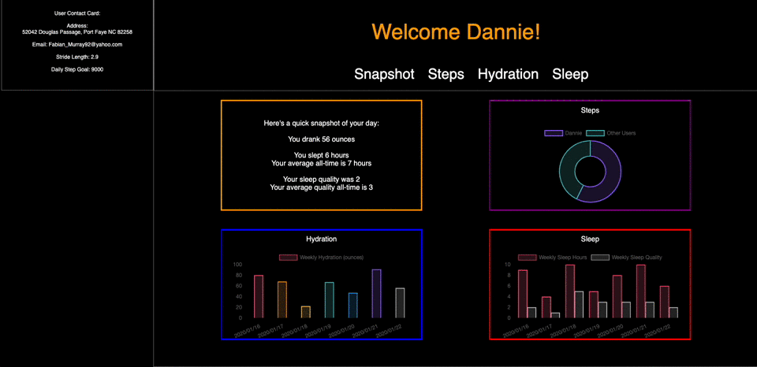

# FitLitty

## Setup

The details and setup of this project are outline in [this project spec](http://frontend.turing.io/projects/fitlit.html).

## Overview:

Fitlitty is a wellness app that tracks a users  information including sleep, hydration and activity. The app shows a personalized interface, with personal information and widgets for respective wellness categories. Information shown includes sleep time and quality compared to user's all time average, as well as interactive graphs showing weekly sleep, weekly hydration and today’s step count compared to all users.

## Goals:

- Implement ES6 classes that communicate to each other as needed
- Use object and array prototype methods to perform data manipulation
- Create a user interface that is easy to use and clearly displays information.
- Write modular, reusable code that follows SRP (Single Responsibility Principle)
- Implement a robust testing suite using TDD
- Make network requests to retrieve data
- Work with a local server and make network requests to API endpoints to retrieve and manipulate data
- Refactor your code to DRY up repetitive logic
- Ensure your app follows best practices for accessibility
- Practice talking about your code and high level technical concepts
- Implement feedback to improve product and process.

## Tech used:
- JavaScript
- Mocha
- Chai
- CSS
- HTML
- VS Code & Atom

## Challenges:
- Implementing the Fetch API
- The donut graph sizing was hard to fit to size
- Thinking of sad paths for testing
- Deciding on class structure and where each method should live

## Wins:
- Making our function dynamic made building the later classes much easier
- The initial planning of how we would approach the project
- The project board helped keep us on track

## Testing:
Mocha and chai are already set up, with a boilerplate test for you.

### Design Inspiration:
For this project we sourced inspiration from Dribble creators, and also used our imagination during the building process to make it our own!

### Example of Project:

### Future Additions:
- Functionality that allows the user to filter by date
- A feature that allows the user to change the color scheme
- Pictures to the design

## Contributors:
- [Trish Fox-Collis](https://github.com/tfoxcollis)
- [Masaki Kleinkopf](https://github.com/masaki-kleinkopf)
- [Kendall McGree](https://github.com/kendallm360)
